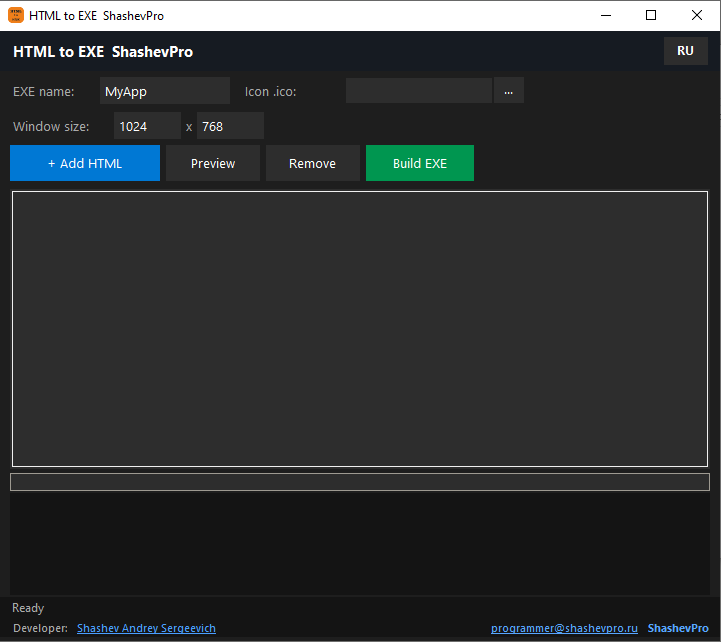
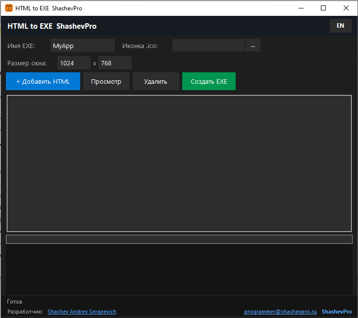

# HTML to EXE · ShashevPro

### Pack any HTML page into a standalone Windows application — one click, one .exe

> Got an HTML tool, game, form, or dashboard? **HTML to EXE** wraps it into a native Windows `.exe` — no browser, no installation, no dependencies. Your users just double-click and run.

---

## ✨ Features

- **Full HTML/CSS/JS support** — Canvas, localStorage, external fonts, media files all work inside the exe
- **File save dialogs** — your HTML app can save JSON, PDF, text files via native Windows dialogs
- **Custom icon** — set any `.ico` file; it appears on the exe and in the taskbar
- **Custom window size** — set exact width × height at build time
- **Preview before build** — check your page renders correctly before packaging
- **One output file** — single portable `.exe`, runs on Windows 10 / 11 without extra software
- **Bilingual UI** — switch between Russian and English on the fly

---

## 🖥 Screenshots

---

## ⚙️ How to use

1. Click **+ Add HTML** and select your `.html` file
2. Enter the EXE name, choose an `.ico` icon, set the window size
3. Click **Preview** to check the result
4. Click **Build EXE** — done

The output is a single portable `.exe` ready to distribute.

---

## ⚙️ Requirements

- Windows 10 / 11 (64-bit)
- Portable — no installation required
- License key file placed next to the executable

---

## 💼 Commercial product

Source code is **not public**. HTML to EXE is a commercial product distributed under the **ShashevPro** brand with a license key.

**Buy a license or request a demo:**

- 🌐 Website — [shashevpro.ru](https://www.shashevpro.ru)
- 🛒 Order on Kwork — [kwork.ru/user/shashevpro](https://kwork.ru/user/shashevpro)
- ✉️ Email — programmer@shashevpro.ru
- 💬 VK — [vk.com/shashevpro](https://vk.com/shashevpro)

---

**© ShashevPro · Andrey Shashev** — commercial software, source not public.

